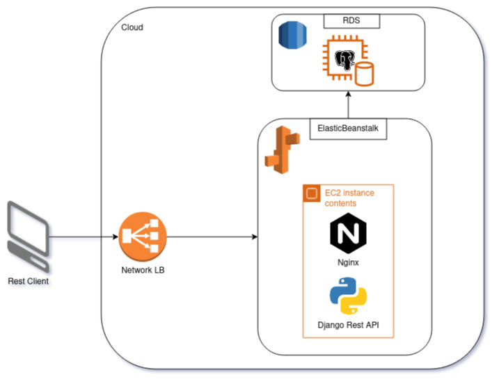
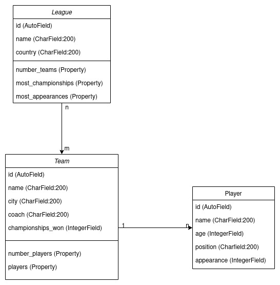

# leagueAPI

## AWS Infra


## leagueAPI diagram


## Requisitos
- Terraform
- Docker
- Docker-compose
- EB CLI

## Local
### Startando o ambiente local

```
cd local/
docker-compose up --build -d
```

### Parando o ambiente local

```
docker-compose down
```

## AWS

### Setup do terraform
Criar o terraform.tfvars na raiz do dir terraform com o seguinte conteudo:

```
# AWS Settings
aws_access_key = "..."
aws_secret_key = "..."

# RDS Settings
db_pass        = "..."
```

### Rodando o terraform
```
terraform init
terraform apply
```

### Deploy com eb cli
```
eb init -i
eb deploy
```

## Documentação da API

A DOC está disponivel em /swagger-ui/

## Testes

Existem testes unitários e funcionais para todos os models.
Para executar esses testes:
```
python3 manage.py test
```